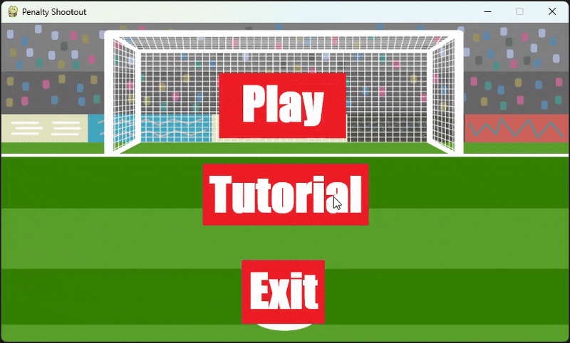
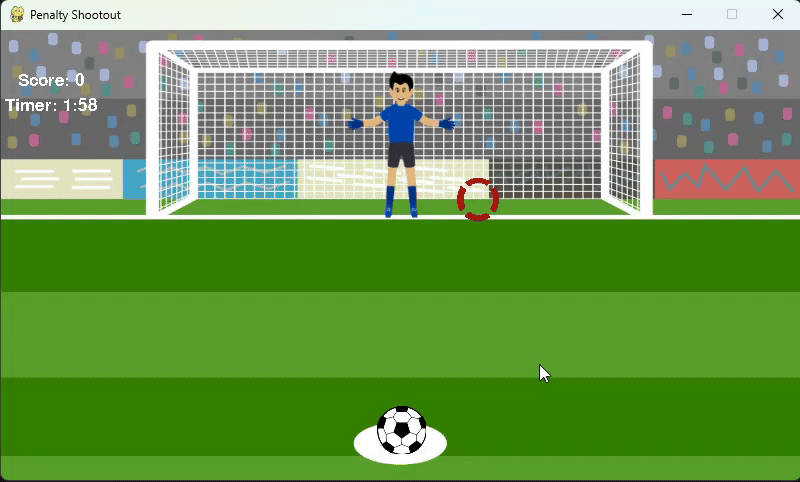

# ⚽ Penalty Shootout Game

A fun and interactive football (soccer) **Penalty Shootout** game developed in **Python** using the **Pygame** library. This was originally created as part of my A-Level Computer Science NEA, and I've expanded and polished it to showcase my game development skills.

---

## 🎮 Features

- 🧠 Simple CPU-controlled goalkeeper movement
- 👟 User-controlled direction shooting system
- 🎯 Score tracking and game timer
- 🎨 Custom graphics, fonts, and animations
- 🔊 Sound effects for kicks, goals, and misses
- 📏 Responsive controls and game loop logic

---

## 🛠️ Tech Stack


---

## 🖼️ Screenshots

### Menu


### Shooting


---

## 🚀 Getting Started

### Prerequisites

- Python 3.x
- Pygame installed (`pip install pygame`)

### Run the game:

```bash
git clone https://github.com/AKhan025/penalty-shootout-game.git
cd penalty-shootout-game
python main.py
```

---

## 📁 Folder Structure
```
penalty-shootout/
│
├── Graphics/           # Images
├── Audio/              # Sounds
├── Screenshots         # Screenshots/gifs of the game
├── main.py             # Game logic entry point
├── README.md
```

---

## 💡 Development Highlights
- Applied agile methodology and iterative design during development.

- Used object-oriented programming to manage game components (ball, player, goalie).

- Focused on user experience by tweaking timing, UI feedback, and animations.

 - Integrated user feedback from initial testers to improve responsiveness and fun factor.

## 🎓 Educational Purpose
This game was originally created for my A-Level Computer Science NEA project and then improved further during my degree to demonstrate skills in:

- Game mechanics

- Pygame animation & sound integration

- Event loops & UI handling

- Agile project development

## 📫 Contact

[](https://www.linkedin.com/in/arif-u-k)
[](mailto:ak5316221@gmail.com)
